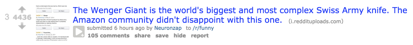
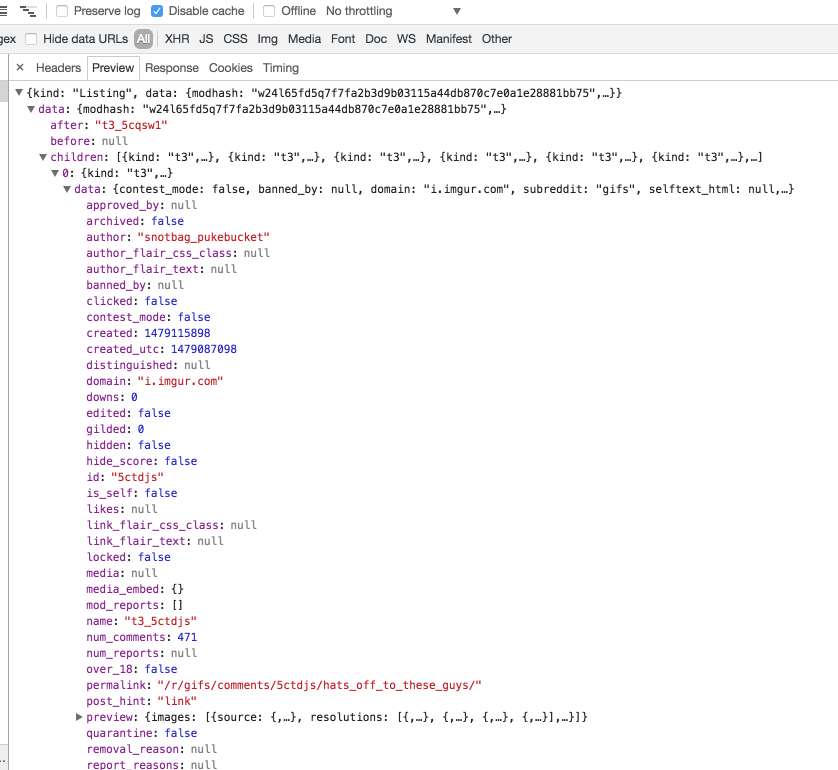
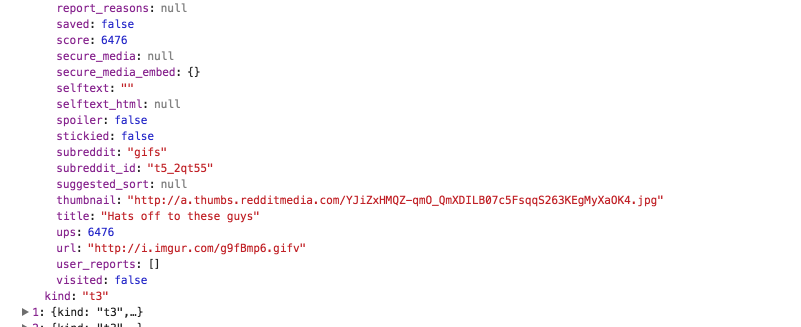

# React Tutorial Starter Kit
Learn React by building a Reddit client!

## Overview
This tutorial is split into several sections. The *completed* state of each section is represented by a branch checked into this repository. Each section's code will begin where the previous section's code left off.

The first section, [Getting Started](#GettingStarted) begins with the code in the [getting-started](tree/getting-started) branch of this repository. Each branch is accompanied by a README that walks you through that section's tasks (the Create React App boilerplate below is removed).

1. <a name="getting-started"></a>[Getting Started](tree/getting-started)
    - [Reviewing the project layout](#project-layout)
    - [Creating your first React component](#first-comp)
      - [Building a container for a Reddit post](reddit-post-container)
    - Building the Reddit homepage
      - Adding a header
      - Building a listing
2. [Using React-Router](tree/using-react-router)
    - Adding pages (routes)
    - Assigning components to routes
    - Passing state between routes
3. [Managing Data in React](tree/managing-data-in-react)
    - Fetching data from remote resources
      - Add the Reddit homepage's top, new, etc. resource urls
    - Using promises
    - Managing state in a React component
4. [Adding Redux to your app](tree/adding-redux)
    - Why Redux & Redux basics
    - Adding Redux actions
    - Adding Redux reducers
    - Jumpstate
5. [Putting it all together](tree/putting-it-all-together)
    - Building a Subreddit
    - Building a comments page
6. Next steps
    - See if you can add authentication - Reddit uses OAuth2
    - See if you can make a new post!

# Getting Started

## <a name="project-layout"></a>Reviewing the project layout
The project layout you see is quite typical of React projects. As we went over in the Modularity & Webpack training, there are lots of different ways to layout a project.

The first thing you'll notice are the folders. At a high level, each top level folder contains the following:

- config: The environment loader, ES6 polyfills, and webpack config files
- public: The index.html file used to bootstrap the React application into the browser
- scripts: The npm start, build, and test scripts, and one to collect required user info to run the app.
- src: The source code of the actual webapp
- src/api: The source for the Reddit client and the URL map. You will edit these eventually.

Look inside the `src` directory - what do you notice? You have an flag structure with a couple of `index` files, a few `App.*` files, and an image. Look inside each one to understand the naming conventions.

Your first exposure to React is in `src/App.js`. What's the first thing you notice? It looks very much like HTML right? It has just been wrapped inside some Javascript. This format is called [`JSX`](http://buildwithreact.com/tutorial/jsx) and is one of the major innovations of React. By bringing HTML into the Javascript, you no longer need to hop between files in order to keep a part of your application in your head - it's all right in front of you.

You also have the advantage of using 100% familiar paradigms: Javascript is just javascript, HTML is just html.

## <a name="first-comp"></a>Creating your first React component
`src/App.js` has been created for you. If you know some HTML, you can already get started!

Let's start building the basic structure of the Reddit homepage. What components will we need? Probably, at a high level, the following:

- A header, that lists the available Subreddits and provides links to Top, New, Rising, etc.
- A *listing* of the current top Reddit frontpage posts
- A *container* for a single Reddit post

### <a name="reddit-post-container"></a>Building a container for a Reddit post
Let's start with the last one, building a container for a Reddit post - it's the most basic piece right?

What does a Reddit post contain? Let's take a look:


We see a few basic elements:
- A thumbnail image
- A title
- The number of votes the thread has
- The age of the post, and the poster's name
- The subreddit the post belongs to
- The number of comments
- Jumplinks related to the post

If we are going to build a container, we should include most of these items.

Looking at `src/App.js` we know we just need to build our familiar HTML. Let's start by creating a new `component` - What React calls a container for HTML, data, and state. Create a file in `src` called `PostItem.js`. The code below should give you a good start on creating a rudimentary container for this data.

```js
import React from 'react';

function PostItem(props) {
  const { title, thumbUrl, voteCount, commentCount, createdDate, createdBy, subreddit } = props;
  return (
    <div className='post'>
      <div className='post-item'>
        <div className='post-item_votes'>
          <span className='post-item_votes--text'>{voteCount}</span>
        </div>
        <div className='post-item_thumb'>
          
        </div>
        <div className='post-item_body'>
          <div className='post-item_body--title'>
            <span>{title}</span>
          </div>
          <div className='post-item_body--data'>
            <span className='post-item_body--data--age'>{createdDate}</span>
            <span className='post-item_body--data--createdby'>{createdBy}</span>
            <span className='post-item_body--data--subreddit'>{subreddit}</span>
          </div>
          <div className='post-item_body--jumplinks'>
            <span className='post-item_body--jumplinks-commentcount'>{commentCount}</span>
          </div>
        </div>
      </div>
    </div>
  );
}

export default PostItem;
```

There's a lot going on here, but piece by piece:

- We have declared our imports at the top of the file
- We have defined a function called `PostItem` that accepts a `props` argument
- We have dropped our HTML into a `return` call inside the `PostItem` function
- We have set the `PostItem` object as our module's default export.

This component can now be imported into `src/App.js` and instantiated. Let's do that now:

- In App.js, type `import PostItem from './PostItem';` at the top of the file
- Inside the `render()` call, type the following after the last paragraph after the phrase "This is some extra information": `<PostItem />`. Make sure it is *outside* the final `</p>` tag but *inside* the `</div>`.
- Our `PostItem` is missing data. Let's work together to fill it in.
- Go to your browser and take a look at the refreshed page.
- It's completely, 100% unstyled, but you have created your first React component!
- Let's style the component together.

Finally, let's go get some data!

#### Get the data
Let's start by making the JSON request to get this data, to see what we have available: <a href="https://www.reddit.com/.json" target="_blank">Go to Reddit</a>

Looking at the data in the Chrome Dev Tools, we see:




Reading data in JSON is really easy. Luckily, I have already put together a working Reddit client for you to use, so you don't need to worry about the details of making web requests (unless you want to! In that case, have a look through all the code in the `src/api` folder).

So let's make our data request, grab the JSON, and fill in a container.